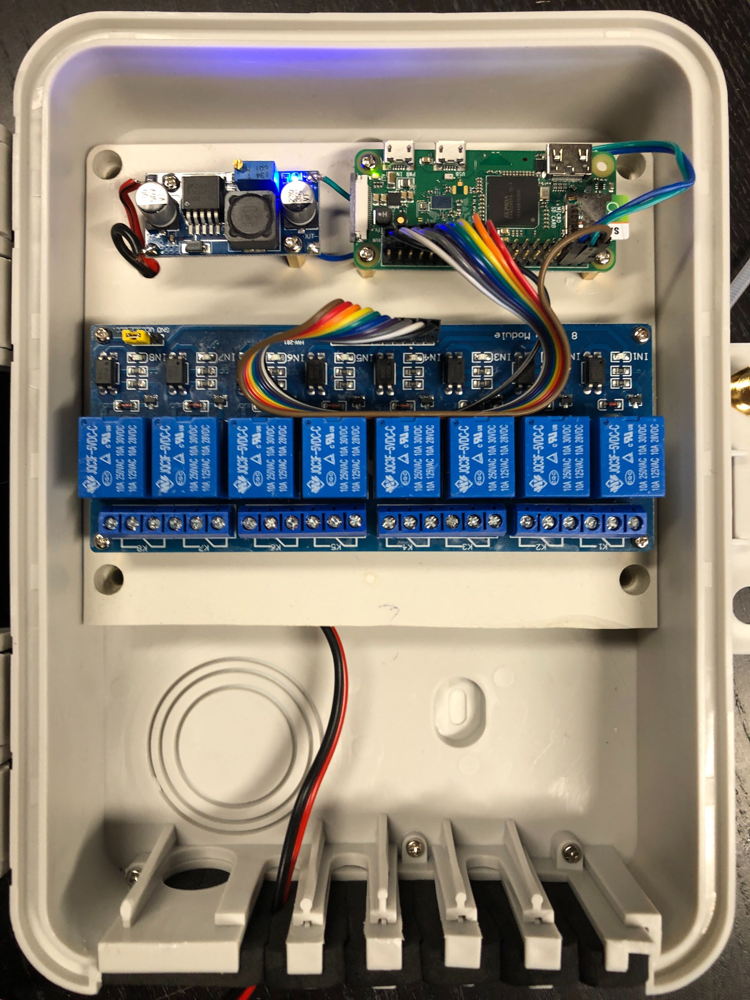

This program is the version 2 of my other project. The version on was
using gevents, it was complex and cumbersome. This version is lighter
and works better.

# lights
Scheduler for garden lights.

## Python packages requirements

This program uses several python modules. On a Raspberry-Pi running
Raspbian can be installed using the `apt` tool.

Install the modules using the following commands.
```
$ sudo apt update
$ sudo apt install git
$ sudo apt install python3-dev
$ sudo apt install python3-rpi.gpio
$ sudo apt install python3-requests
$ sudo apt install python3-tz
```

## Installation

Download `lights` from github. The simplest way to do it is to use the `git clone` command.

```
$ git clone https://github.com/0x9900/lights2.git
```

Go to the newly created directory and use the `install.sh` script to install lights.

```
$ sudo ./install.sh
```

Don't forget to edit the configuration file `/etc/lights.json` and
specify the gpio ports you are using as well as the time zone, and
your GPS coordinates.

Then create a task file. The format is:
`lights		start_time	end_time	weekdays`

The fields `lights` can be a * for all the lights or the list between
brackets. Example: [1, 3, 5]

`start_time` and `end_time` can be a time with hour column minutes,
such as: `17:00` or one of the following keywords: `sunrise`,
`sunset`, `solar_noon`, `civil_twilight_begin`, `civil_twilight_end`,
`nautical_twilight_begin`, `nautical_twilight_end`,
`astronomical_twilight_begin`, `astronomical_twilight_end`,

You can use the files `lights-example.json` and `tasks-example.dat` as
a starting point for your own configuration.

## Hardware

I use a simple 8 relay board managed by a Raspberry-pi Zero W and a
buck converter to lower the power from 24 Volts to the 5 volts required
by the Raspberry Pi.

The Pi-Zero has more that enough power for that task.




